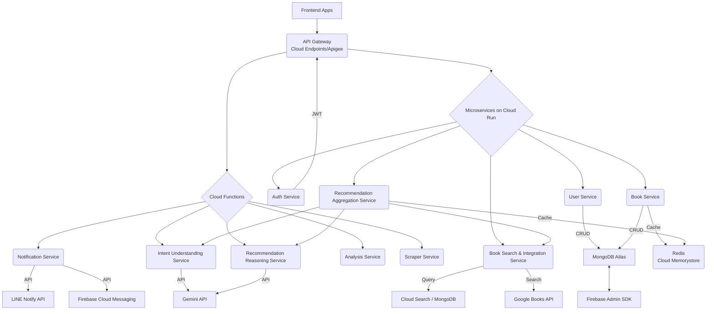

# BookMe 數位產品矩陣與統一後端架構藍圖 (V2.0 - 優化版)

## 文件目的
本文件旨在取代並優化現有專案藍圖中的後端架構部分，提出一個基於 Serverless-first (無伺服器優先) 的混合微服務架構。它將作為 BookMe、Tell Me 和 CoCo Daily 等內容驅動型產品的統一後端開發基礎，並特別強化 AI 推薦功能的實現方式。

## 1. 專案願景與核心價值
我們的策略是從單一專案的技術挑戰演進為一個多產品的宏觀佈局，並為不同性質的產品制定最合適的架構決策。

### 1.1 核心決策：統一後端 vs. 獨立架構
- **建立統一後端**：針對 TELL ME、BookMe、特價通知 App (CoCo Daily) 這三個本質上為「內容驅動」的應用，我們將建立一個統一的後端服務集合，以最大化資源共用與開發效率。
- **保持遊戲獨立**：對於 Vampire Survivors Clone 這類重度依賴客戶端即時運算的產品，將與內容型 App 的後端分離，可考慮採用更輕量的 Firebase 處理排行榜、雲端存檔等功能。

### 1.2 最終藍圖：一個可擴展的數位事業地基
- **核心技術**：以 Google Cloud Platform (GCP) 為核心，採用 Serverless-first (無伺服器優先) 理念，搭建多個獨立部署的微服務。
- **服務擴展**：為「CoCo Daily」新增爬蟲服務 (Scraper Service) 與通知服務 (Notification Service)；為所有內容型 App 實現強大的 AI 推薦和分析功能。
- **開發模式**：確立前端、後端、遊戲團隊可獨立作業的平行開發路線圖。

## 2. 全新後端架構總覽 (Optimized Backend Architecture)
此架構摒棄了單一大型 NestJS 應用，轉向更細粒度的獨立 Serverless Functions (FaaS) 與容器化服務 (CaaS) 的混合模式，以實現最佳的彈性、成本效益和可擴展性。

### 2.1 核心技術選型 (Technology Stack)
- **主要服務 (API驅動)**：Google Cloud Run (CaaS) - 部署獨立的 NestJS (Node.js) 服務，按需擴展，自動縮容至零。
- **背景/事件驅動任務 (FaaS)**：Google Cloud Functions - 部署輕量級、短生命週期的 Node.js/Python 函數，處理數據處理、通知發送、定時任務等。
- **API 閘道**：Google Cloud Endpoints 或 Apigee - 提供統一的 API 入口、認證、限流、日誌和監控。
- **數據庫**：
  - MongoDB Atlas (NoSQL) - 核心數據儲存，適合文件型、高彈性數據（用戶、書評、留言）。
  - Google Cloud Memorystore (Redis) - 用於高速緩存、實時計數（如按讚數緩存）、會話管理。
  - (可選) Google Cloud Search 或 Elasticsearch on GCP - 用於高效的全文搜索和複雜的聚合查詢（提升推薦搜索能力）。
- **AI 核心**：Google Gemini API (via Vertex AI) - 強大的多模態模型，用於意圖理解、內容生成和推薦理由生成。
- **認證**：Firebase Authentication - 提供用戶身份管理和第三方登入整合。

### 2.2 整體數據流與服務交互

## 3. 七大核心服務 (優化後拆分與職責)
原藍圖中的七大核心服務將被進一步細化和部署到最適合的 GCP 服務中。

| **服務名稱** | **職責** | **技術棧** | **部署方案** | **相關產品** |
|--------------|----------|------------|--------------|--------------|
| API 閘道 (API Gateway) | 所有 App 請求的統一入口，負責路由、外部認證、限流、日誌。 | Google Cloud Endpoints/Apigee | Google Cloud Endpoints / Apigee | 所有 |
| 認證服務 (Auth Service) | 處理使用者註冊、登入、核發 JWT、以及第三方 OAuth 流程 (如 Instagram, Google)。 | NestJS (Node.js) | Google Cloud Run | 所有 |
| 使用者服務 (User Service) | 管理使用者個人檔案 (Profile)、追蹤 (Follow) 等社交關係，與 MongoDB 互動。 | NestJS (Node.js) | Google Cloud Run | BookMe, Tell Me |
| 書籍服務 (Book Service) | 管理書籍資料快取，處理讀書心得、摘要、金句的 CRUD 與權限，與 MongoDB 互動。 | NestJS (Node.js) | Google Cloud Run | BookMe |
| AI 推薦系統 (整合型) | | | | BookMe |
| &nbsp;&nbsp;&nbsp;&nbsp;用戶意圖理解服務 | 接收抽象概念，理解意圖，提取結構化主題/關鍵字。 | Node.js/Python + Gemini API | Google Cloud Functions | BookMe |
| &nbsp;&nbsp;&nbsp;&nbsp;書籍搜索與整合服務 | 根據意圖，搜索 Google Books API 和內部數據庫，整合書籍信息。 | NestJS (Node.js) + Google Books API | Google Cloud Run | BookMe |
| &nbsp;&nbsp;&nbsp;&nbsp;推薦理由生成服務 | 接收書籍信息、用戶意圖，生成個性化推薦理由。 | Node.js/Python + Gemini API | Google Cloud Functions | BookMe |
| &nbsp;&nbsp;&nbsp;&nbsp;推薦聚合與緩存服務 | 協調上述服務，最終排序結果，並緩存熱門推薦。 | NestJS (Node.js) + Redis | Google Cloud Run | BookMe |
| 分析服務 (Analysis Service) | 背景工作者，執行每日排程任務 (如個人化 AI 分析報告生成)，事件觸發處理數據。 | Node.js/Python | Google Cloud Functions / Cloud Run Jobs | BookMe, Tell Me |
| 爬蟲服務 (Scraper Service) | 定期或事件觸發抓取外部數據 (如 Costco 特價資訊)。 | Node.js/Python | Google Cloud Functions / Cloud Run Jobs | CoCo Daily |
| 通知服務 (Notification Service) | 處理各種通知邏輯 (LINE Notify, App 推播)。 | Node.js/Python + LINE Notify API + FCM | Google Cloud Functions | CoCo Daily, 所有 |
| 資料庫 (Database Layer) | 持久化儲存核心數據。 | MongoDB Atlas / Cloud Memorystore (Redis) | MongoDB Atlas / Google Cloud Memorystore | 所有 |

## 4. GCP 實戰建構藍圖 (高階流程)
採用 **Serverless First (無伺服器優先)** 的核心理念，將架構落地。

### GCP 環境初始化
- 建立 GCP 專案，啟用計費，安裝 gcloud CLI。
- 啟用所需 API：Cloud Run, Cloud Functions, Cloud Build, Cloud Scheduler, Secret Manager, Cloud Endpoints/Apigee, Cloud Memorystore, BigQuery (用於分析數據湖，可選)。

### API 閘道部署
- 配置 Google Cloud Endpoints 或 Apigee，定義 API 路由規則，將外部請求導向對應的 Cloud Run 或 Cloud Functions 服務。
- 集成 JWT 認證策略。

### 微服務容器化與部署 (以 Auth Service 為例)
- 為每個 NestJS 專案（如 auth-service、user-service）創建獨立的 Dockerfile。
- 將敏感資訊（如數據庫連接字串、API Key）存放在 GCP Secret Manager。
- 使用 Cloud Build 自動化建置容器映像檔並推送到 Artifact Registry。
- 將映像檔部署到 Google Cloud Run。配置適當的 CPU/記憶體、最大實例數和自動縮容。

### Cloud Functions 部署 (以用戶意圖理解服務為例)
- 開發輕量級的 Node.js/Python 函數，處理單一職責（例如，調用 Gemini API）。
- 使用 `gcloud functions deploy` 命令部署，配置觸發器（例如，HTTP 請求或 Pub/Sub 事件）。

### 數據庫與緩存層配置
- 在 MongoDB Atlas 配置數據庫實例和安全規則。
- 在 GCP 配置 Cloud Memorystore (Redis) 實例。

### 服務間通信
- **內部 API 呼叫**：Cloud Run 服務和 Cloud Functions 之間通過 GCP 內部 DNS 或專用服務連接器進行安全通信。
- **事件驅動**：利用 Cloud Pub/Sub 實現服務間的非同步通信（例如，新書評發布 -> 觸發分析服務）。

### 監控與日誌
- 利用 Cloud Monitoring 和 Cloud Logging 收集所有服務的日誌和指標，設定警報。

## 5. 前端數據流與 UI 互動 (Flutter)
前端應用程式 (BookMe App) 將完全專注於用戶體驗和界面渲染，所有複雜的業務邏輯和數據持久化都交由後端服務處理。

### API 互動
- 前端通過 `dio` 或 `http` 客戶端，統一呼叫 API 閘道器提供的接口。

### 認證
- 使用 Firebase Authentication SDK 進行用戶登入登出。獲取到 JWT Token 後，後續所有 API 請求都將在 Header 中攜帶此 Token。

### 實時數據同步
- 對於需要即時更新的列表（如首頁動態牆、個人心得列表、留言列表），繼續使用 Firestore 的 `snapshots().listen()` 功能，直接監聽相關集合的變化。
- 這意味著，即使業務邏輯在後端，但像按讚數、評論數等實時計數，可以通過 Firestore 實時更新回前端，提供流暢體驗。

### AI 推薦 UI
- 設計用戶友善的輸入介面，讓用戶可以輸入抽象概念。
- 展示豐富的推薦書籍卡片，突出「為什麼推薦」的理由，以及書籍簡介和購買連結。
- 妥善處理載入狀態和錯誤訊息。

## 6. 結論與優勢
建立一套基於 Serverless 的混合微服務架構，是從「App 開發者」轉變為「產品架構師」的關鍵一步。

- **更安全**：API 金鑰等敏感資訊不落地儲存在 App 中，且 API 閘道提供統一安全入口。
- **更強大**：伺服器可以處理 AI 運算、複雜查詢、排程任務等複雜商業邏輯。
- **更有彈性**：每個服務可獨立開發、部署、更新和擴展，不受其他服務影響。
- **更高效**：Serverless 服務按需付費，低流量時成本極低，高流量時自動擴容。
- **更具智能**：深度整合 Google Gemini API，提供更精準、個人化且具解釋性的 AI 推薦功能。
- **更能擴展**：為未來更多元的商業模式（如會員制、進階 AI 功能、新產品線）奠定穩固的數位基礎建設，並輕鬆支援多個前端應用。

計畫開發的六個應用程式點子：

BookMe (讀書心得分享 APP)

核心概念：打造一個類似 Instagram 的垂直社群平台，專注於書籍分享和讀書心得交流，讓分享閱讀成為一種生活品味的展現。

主要功能：用戶生成內容 (UGC)、讀書心得發布（圖片+文字）、社群互動（按讚、評論、追蹤）、個人檔案頁面、探索功能。

技術整合：將整合 Firebase 作為初期後端（認證、資料儲存、檔案儲存），並計畫未來引入 Vertex AI Agent Builder 實現智能推薦和分析。

Plug AI 中文版 (AI 聊天助手)

核心概念：一款基於 AI 的簡訊與調情助手，旨在提升用戶在約會社交互動中的自信與效率。

主要功能：上傳聊天截圖以生成客製化回覆、生成開場白/搭訕語句、提供約會和自我提升建議。

技術整合：將利用大型語言模型 (LLM) 進行中文語境的提示詞工程，並計畫透過 Vertex AI Agent Builder 實現更精準、在地化的 AI 回覆。

CoCo Daily (特價通知 APP)

核心概念：一個輕量級的每日特價資訊聚合與通知工具，專注於大型賣場（如 Costco）的特價資訊。

主要功能：APP 內顯示每日特價商品清單、透過 LINE Notify 推送精選特價通知。

技術整合：需要網路爬蟲服務來獲取數據，後端負責處理 API 請求和整合 LINE Notify API。

PolyBuzz (AI 角色聊天機器人 APP)

核心概念：一款強調「角色扮演」與「情感連結」的 AI 聊天機器人 APP。

主要功能：與不同個性的 AI 角色進行對話、提供情感支持與陪伴、支援多模式互動（文字、語音）、用戶可自定義 AI 角色。

技術整合：將利用 Vertex AI Agent Builder 建立多個具有不同個性和知識庫的 AI 角色 Agent。

MECO (AI 角色聊天機器人 APP)

核心概念：與 PolyBuzz 類似，也是一款基於 AI 的智能聊天軟體，主打 AI 角色扮演、情感陪伴與高度客製化。

主要功能：與預設或自定義 AI 智能體聊天、語音互動、上下文理解與記憶、內容創作輔助。

技術整合：與 PolyBuzz 共享類似的 AI 角色構建技術棧，同樣適合 Vertex AI Agent Builder。

戒手機成癮 APP (數位健康/專注力管理 APP)

核心概念：幫助用戶意識到、限制和取代不健康的手機使用習慣，提升數位健康和專注力。

主要功能：螢幕使用時間追蹤與統計、應用程式使用時限與封鎖、專注模式與遊戲化（如虛擬種植）、習慣養成與目標設定。

技術整合：將利用 Firebase 進行數據儲存與通知，並可能結合 AI（透過 Vertex AI Agent Builder）提供個人化戒癮教練或支持夥伴。